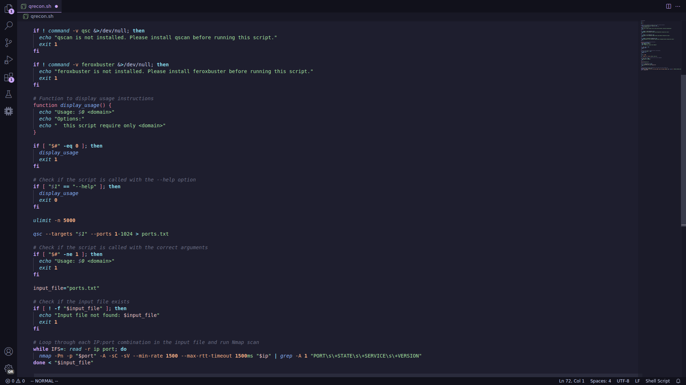

# qrxnz-vscodium

## Extensions

- bungcip.better-toml
- Catppuccin.catppuccin-vsc
- Catppuccin.catppuccin-vsc-icons
- cl.eide
- danielpinto8zz6.c-cpp-project-generator
- EdwinKofler.vscode-hyperupcall-pack-go
- golang.go
- hbenl.test-adapter-converter
- hbenl.vscode-test-explorer
- llvm-vs-code-extensions.vscode-clangd
- muhammad-sammy.csharp
- neonxp.gotools
- pinage404.rust-extension-pack
- r3inbowari.gomodexplorer
- rust-lang.rust
- rust-lang.rust-analyzer
- serayuzgur.crates
- Swellaby.vscode-rust-test-adapter
- vadimcn.vscode-lldb
- vscodevim.vim
